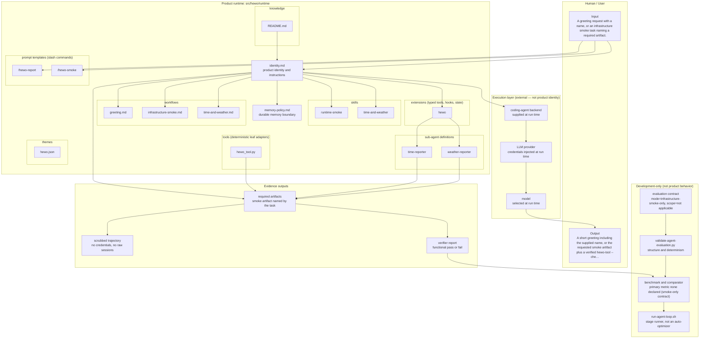

# Coding Agent Template

> **Role of this document**
> - **Audience:** a human developer evaluating or adopting this template, plus the development coding agent orienting itself in a fresh checkout.
> - **Authority:** informative. It explains what exists and points at the normative documents; it decides nothing.
> - **Tone:** explanatory and concrete; every command shown must be one that actually runs.
> - **Language:** 中文（代码、命令、协议标识保留原文）.
> - **Contains:** what the template is, the scaffold/backend/provider layering, the repository layout, and the entry points into each deeper document.
> - **Excludes:** binding development rules (see `AGENTS.md`), day-to-day development procedure (see `DEV.md`), end-user installation and usage (see `USER.md`), and product behavior (see `src/hewo/runtime/`).

## 中文文档导航与边界

本仓库的文档按四个边界维护，所有说明正文统一使用中文；代码、命令、文件名、协议标识和产品内固定哨兵值保留原文。

| 文档 | 唯一职责 | 权威性 |
| --- | --- | --- |
| `AGENTS.md` | 开发 coding agent 的强制规则、证据要求和边界 | 规范性 |
| `DEV.md` | 日常开发、验证和发布操作步骤 | 操作性 |
| `USER.md` | 终端用户安装、运行和故障处理 | 用户说明 |
| `src/hewo/runtime/` | hewo 产品运行时身份、技能、提示词、工作流和知识 | 产品规范 |
| `benchmarks/README.md` | 基准运行条件、结果分类和可声明范围 | 规范性 |
| `DevelopmentMachine.md` | 当前开发机器的已核验事实（不含秘密） | 记录 |
| `PLAN.md` | 一次性设计计划和历史决策 | 记录 |

文档之间的引用只沿上述边界传递：开发规则不得进入产品运行时，用户说明不得定义开发流程，基准结果不得直接改写产品行为。发现冲突时，以 `AGENTS.md` 的开发规范、`src/hewo/runtime/` 的产品定义和各文档声明的职责为准；历史计划只用于追溯，不能覆盖现行规则。

这是一个用于构建可安装 Agent 的开发仓。当前仓库只有一个被开发和交付的产品
agent：**hewo**；它的全部产品源码位于 `src/hewo/`，行为定义位于
`src/hewo/runtime/`。其他目录不是 hewo 的产品实现：`AGENTS.md`、`.agents/`
是维护本仓库的开发 coding agent 使用的开发指令和资源，`scripts`、`docker`、
`benchmarks`、`distribution` 是 template 基础设施。


This repository has two strictly separate identities. The **development coding agent** maintains this repository and follows `AGENTS.md` plus `.agents/`. The **product agent** is `hewo`, what users install and run; it follows only the definition under `src/hewo/runtime/`. Development instructions are never product behavior, and all `AGENTS.md` files are excluded from installation, release archives, and final Docker images.

For downstream repositories, the same product boundary is renamed to
`src/<agent_name>/runtime/`; that placeholder describes how this template is
reused, not an additional product in this repository.


```bash
cp .env.example .env
# Edit .env and set OPENAI_API_KEY: the run below fails closed without it.
./scripts/validate-definition.sh hewo
docker build --build-arg AGENT_NAME=hewo -t hewo:dev -f docker/Dockerfile .
docker run --rm -it --env-file .env hewo:dev "Say hello to Ada"
```

The `run-hewo-e2e.sh` helper injects a provider and model at run time without
requiring manual exports:

```bash
./docker/run-hewo-e2e.sh --agent hewo --provider openai --model gpt-5.5 --api-key-env OPENAI_API_KEY "完成这个任务"
```

## Backend: pi, and only pi

`hewo` runs on the **pi** coding agent. There is no second backend and no
fallback: asking for another one is an error, not a silent default.

```bash
# pi with an existing read-only auth store
./docker/run-hewo-e2e.sh --agent hewo --provider openai-codex --model gpt-5.5 \
  --pi-auth-file "$HOME/.pi/agent/auth.json" "hi"
```

The launcher does not flatten the runtime into one prompt blob. It reads
`src/hewo/runtime/package.json` — the single source of truth for what the
runtime loads — and hands each resource to pi's own loader:

| Runtime resource | How pi loads it |
| --- | --- |
| skills | `--skill <dir>` |
| prompt templates (slash commands) | `--prompt-template <dir>` |
| theme | `--theme <dir>` |
| TypeScript extension | `--extension <file>` |
| tool allowlist | `--tools <list>` |
| identity, memory policy | `--append-system-prompt`, one segment per file |
| knowledge, workflows | `--append-system-prompt`, one segment per file with a provenance header |

Only the last two are prompt injection, and only because pi has no primitive
for them. Everything else is a real, separately loadable pi resource.

The launcher also closes the discovery boundary. It passes
`--no-context-files` so pi never pulls an `AGENTS.md` into the product agent,
`--no-skills` and `--no-extensions` so ambient project and global resources are
not silently mixed in (explicit `--skill` and `--extension` remain additive),
and `--no-approve` so project-local files are not trusted implicitly. Every
manifest path must be a normalized relative path inside the definition
directory; absolute paths, `..` traversal, globs, shell metacharacters and
symlinks are refused rather than sanitized.

Outbound network access and elevated capabilities are **denied by default**.
The weather capability ships with a deterministic fixture provider that needs
no network; live lookups require an explicit opt-in, an allowlisted host and a
timeout, and degrade back to the fixture on any failure rather than failing the
task.

The scaffold, coding-agent backend, and LLM provider remain independent layers.
HeWo is a complete, intentionally scoped Hello World Agent — not a degraded
one — and the provider/model below is only a run-time choice:

- The scaffold is hewo's runtime definition under `src/hewo/runtime` (a
  downstream repository renames this path to `src/<agent_name>/runtime`).
- The backend is pi.
- The provider/model is selected at run time and never baked into the scaffold.

For a short-lived read-only provider runtime bundle, create it and pass it to Docker:

```bash
bundle=$(mktemp -d)
./scripts/create-provider-bundle.sh openai gpt-5.5 OPENAI_API_KEY "$bundle"
./docker/run-hewo-e2e.sh --agent hewo --provider openai --model gpt-5.5 --bundle "$bundle" "完成这个任务"
rm -rf "$bundle"
```

The bundle is mode `0700`, its credential is mode `0600`, and Docker mounts it read-only at `/run/provider-bundle`. It contains only the selected provider metadata and one credential, never the host `HOME` or any CLI authentication database.

Use `--api-key-stdin` when the key should not appear in shell history, `--pi-auth-file PATH` for one explicit read-only pi auth store, or `--env-file PATH` for a provider-specific environment file. Run `./docker/run-hewo-e2e.sh --help` for all options.

Never commit provider keys. Credentials are injected at run time through environment variables or Docker secrets, and are never baked into the image, Git, or the runtime.

## Layout

`src/hewo/runtime` is the hewo product Agent definition shipped to users. The
**development coding agent** that develops this template uses `AGENTS.md` and
`.agents/` for reusable development memory, knowledge, skills, and workflows;
it must not treat those resources as hewo behavior. `scripts`, `docker`, and
`benchmarks` are template infrastructure. `distribution` contains the public
installer and launcher.

The key feature is definition-first development: create or modify an Agent by editing its runtime identity, skills, prompt templates, memory policy, and the `package.json` resource manifest rather than implementing another runtime. Use GitHub Issues for design decisions and acceptance evidence; do not add `docs/` or unit-test suites for Agent behavior.

## Provider contract

The image contains no credentials and does not bake in a provider. The E2E
helper passes the selected provider, model, and provider key at run time. It
supports arbitrary provider names using `<PROVIDER>_API_KEY`, explicit key
variables, env files, or one explicitly mounted pi auth store. The entrypoint
fails closed when neither a provider key nor an explicit auth store is
supplied. Every E2E report records `backend=pi` plus the actual CLI version,
provider, model, credential-source flag, and Agent Definition revision.

pi resolves credentials in this order: `--api-key`, then its `auth.json`, then
the environment variable, then a custom provider key. `pi --list-models` is
auth-filtered, so it is a readiness probe rather than a catalog.

## Create a new agent

```bash
cp -R src/hewo src/my-agent
./scripts/validate-definition.sh my-agent
```

`src/hewo`（Hello World）是本 template 中功能完整、刻意限定范围的参考产品
Agent，也是当前仓库实际开发的产品。使用它验证完整 runtime 路径；如果要创建
下游产品，才复制并改名为 `src/<agent_name>`：

```bash
./scripts/validate-definition.sh hewo
./docker/run-hewo-e2e.sh --agent hewo --provider openai --model gpt-5.5 "Say hello to Ada"
```

Replace `src/hewo` only when creating a separate downstream product Agent. In
this repository, keep hewo's product behavior under `src/hewo/`; keep the
**development coding agent** instructions in `AGENTS.md` and `.agents/`, and do
not put template workflow instructions inside `src/hewo/runtime`.

Use `scripts/build-release.sh hewo 0.1.0` to produce a bundle containing only runtime behavior. The release contains its own installer and launcher; the baked installer is also published as a standalone release asset so users can install with one command and no environment setup. Record release and E2E evidence in the relevant GitHub issue and run `scripts/collect-trace.sh` before storing trajectory evidence.

This project follows a reuse-first development philosophy: an independent
developer should build Agent behavior with prompts, skills, memory, knowledge,
workflows, and tools, while delegating execution, model adapters, approvals,
and terminal UX to the established coding-agent CLIs. The template therefore
adds only the thin scaffold/launcher/provider wiring needed to compose those
systems; it does not reimplement a coding-agent runtime.

A release installation installs pi when the user does not already have it; set
`SKIP_RUNTIME_INSTALL=1` to skip that. `AGENT_BACKENDS` is accepted only as
`pi` and is rejected otherwise. Runtime npm dependencies, if a downstream Agent
declares any, are installed frozen with `npm ci --ignore-scripts`, and a
dependency without a lockfile is refused rather than resolved at install time.
A release archive is installed without cloning this repository: one command
fetches the baked installer, which downloads the matching archive itself (no
`RELEASE_URL` or version setup). Published versions are listed under the
repository's GitHub Releases; check there for the current version rather than
assuming the one written below.

The no-clone installation flow is:

```bash
curl -fsSL https://github.com/a-green-hand-jack/coding-agent-template/releases/latest/download/install.sh | bash
export PATH="$HOME/.local/bin:$PATH"
hewo --version
```

`benchmarks/` contains a benchmark contract, the `hewo-infrastructure-smoke`
task, and a deterministic verifier. Run the complete smoke with:

```bash
PI_AUTH_FILE="$HOME/.pi/agent/auth.json" \
LLM_PROVIDER=openai LLM_MODEL=gpt-5.5 \
BENCHMARK_RUN_DIR=/tmp/hewo-evidence \
./scripts/run-benchmark.sh hewo
```

The benchmark writes only disposable workspace artifacts and a scrubbed
trajectory; never commit the evidence directory or raw provider output. For
full product-agent iteration, run the project-internal evaluation loop from
`.agents/workflows/agent-development.md`. Long E2E or benchmark validation is
submitted through the loop helper's registered background mode
(`./scripts/run-agent-loop.sh --background ...`, then `--list-runs`,
`--run-status <id>`, `--clean-run <id>` and `--gc`), so it can be queried and
cleaned up without blocking the developer session. The preflight still runs in
the foreground, so an invalid invocation fails there rather than inside a
detached run.

Submitting a run freezes the worktree into a snapshot that run owns, and builds
a content-addressed image (`<agent>:def-<digest>`) from it. Every stage reads
the snapshot, so editing the product Agent while a run is in flight changes
neither what that run tests nor what its evidence records.

## Development environments

The template supports both ecosystems. Python tooling is declared in `pyproject.toml` (with `requirements-dev.txt` for pip users); run `./scripts/setup-dev.sh` to create `.venv` and install development dependencies. TypeScript tooling is declared in `package.json` and `tsconfig.json`; use `npm ci` when a lockfile is present. These environments are for the **development coding agent** and validation scripts only. They are not copied into `src/hewo/runtime/` (or a downstream `src/<agent_name>/runtime/`) or shipped to end users.

The Dockerfile is multi-stage. Its builder may read the repository, but the final runtime image copies only the installed product runtime and launcher plus the pi CLI package. Template development resources, tests, benchmarks, `AGENTS.md`, and `.agents/` cannot be reached from the user container.

## Agent diagrams

Generated by the development-only `agent-evaluation-loop-design` skill. The
`.mmd` files are the single source of truth; the blocks below are generated and
are rewritten in place, so never hand-edit them.

Regenerate them with:

```bash
python3 .agents/skills/agent-evaluation-loop-design/scripts/generate-agent-diagrams.py \
  --agent hewo --repo-root . --output-dir . --readme README.md
python3 .agents/skills/agent-evaluation-loop-design/scripts/validate-agent-evaluation.py \
  --agent hewo --repo-root . --output-dir . --readme README.md --strict
```

The first diagram answers what the product Agent is; the second answers how it
is iterated, as a state machine with guards rather than a checklist. They
describe **this template's** `hewo`, whose evaluation contract is
`infrastructure-smoke-only` — so its honest state is
`SMOKE_ONLY_NOT_PERFORMANCE_EVIDENCE`, not a demonstrated performance gain. A
downstream repository must write its own contract and regenerate its own
diagrams; these are not downstream product facts. GitHub renders the Mermaid
blocks; some other Markdown renderers will show them as code.

Source: [`agent-architecture.mmd`](agent-architecture.mmd)

<!-- BEGIN GENERATED: agent-architecture.mmd -->

<!-- END GENERATED: agent-architecture.mmd -->

Source: [`agent-optimization-loop.mmd`](agent-optimization-loop.mmd)

<!-- BEGIN GENERATED: agent-optimization-loop.mmd -->

<!-- END GENERATED: agent-optimization-loop.mmd -->
