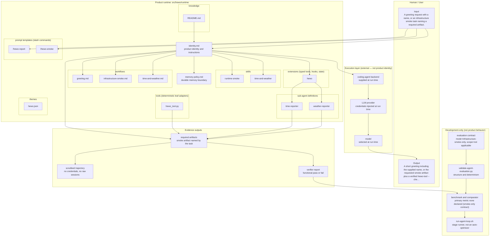

# Coding Agent Template

> **Role of this document**
> - **Audience:** 评估或采用本 template 的 human developer。
> - **Authority:** informative；定位与导航，不定义开发规则或产品行为。
> - **Tone:** 简洁、具体。
> - **Language:** 中文，保留代码、命令和协议标识。
> - **Contains:** 产品定位、分层、目录导航、产品结构与优化状态图。
> - **Excludes:** coding agent 内部流程（见 `.agents/`）、日常命令（见 `DEV.md`）、安装使用（见 `USER.md`）。

用于构建、验证和发布 **pi-native Agent runtime package** 的开发模板。当前参考产品是 **hewo**：功能完整、范围刻意限定的 Hello World Agent，用于验证安装、runtime 加载、skills、工具、workspace 和 artifacts 路径；不是通用 Agent，也没有已证明的性能优化结论。

三层独立：**Agent scaffold → pi backend → LLM provider/model**。用 identity、skills、knowledge、workflows、prompt templates、extensions 和 tools 组合产品，不重新实现 coding-agent runtime。pi 是唯一 backend，没有第二 backend 或静默 fallback；provider/model 在运行时选择，不写死在产品里。

用户自行安装 pi，再显式加载安装后的 runtime package；没有独立 `hewo` CLI 或兼容 wrapper。installer 不安装 pi、不配置 provider 或凭据。产品默认拒绝外部网络和提权；天气能力使用无需网络的 fixture，live lookup 必须显式 opt-in、限制 host 和 timeout，失败回退 fixture。完整能力、安装和使用见 [USER.md](USER.md)。

## 快速开始

在仓库根目录准备环境，再运行真实 Docker 请求。先把 `<provider>` / `<model>` 替换为本机已配置的实际值：

```bash
./scripts/setup-dev.sh
./docker/run-hewo-e2e.sh --provider <provider> --model <model> \
  --pi-auth-file "$HOME/.pi/agent/auth.json" "向 Ada 问好"
```

凭据只在运行时注入，不进入镜像、Git 或 runtime。helper 缺少凭据来源会拒绝请求；镜像构建或 CLI 启动不是产品 E2E 通过。环境准备、release artifact 验证、后台日志和发布命令见 [DEV.md](DEV.md)。最终用户无需 clone 仓库，按 [USER.md](USER.md) 下载 release installer 安装即可。

## 布局与导航

| 路径 | 用途 |
| --- | --- |
| [USER.md](USER.md) | human 用户安装、运行和故障处理 |
| [DEV.md](DEV.md) | human 开发环境、Docker E2E、后台任务与发布指南 |
| [src/hewo/runtime/](src/hewo/runtime/) | 唯一发布给用户的产品定义，排除所有 `AGENTS.md` |
| [.agents/development/hewo/](.agents/development/hewo/) | 产品设计与评估 contract，不发布 |
| [scripts/](scripts/) | human 操作入口：setup-dev、build-release、publish-release |
| [docker/](docker/) / [distribution/](distribution/) | Docker E2E、镜像、installer 和薄容器 entrypoint |
| [.agents/](.agents/) | 开发 coding agent 的 knowledge、memory、skills、workflows 与内部 scripts |
| [.agents/knowledge/development-procedures.md](.agents/knowledge/development-procedures.md) | 初始化/实现 prompts、选择性复用、内部审计、评估闭环与图表维护 |
| [AGENTS.md](AGENTS.md) | 开发 coding agent 的强制规则，不是产品上下文 |
| [benchmarks/README.md](benchmarks/README.md) | benchmark 条件、结果分类和可声明范围 |

开发 coding agent 维护仓库；产品 agent 只使用 `src/hewo/runtime/`。`.agents/`、开发历史、benchmarks 和所有 `AGENTS.md` 都不进入产品发布载荷。设计决策和验收证据使用 GitHub Issues，机器事实保留在本机生成、不入库的 `.agents/local/DevelopmentMachine.md`，历史计划只用于追溯。

创建独立下游产品时才将产品路径适配为 `src/<agent_name>/runtime/`，不要在本仓库添加第二个产品或整目录复制 `.agents/`。下游初始化和基础设施选择性复用入口见 [开发内部流程](.agents/knowledge/development-procedures.md)。

## Agent diagrams

第一张图说明产品组成；第二张图说明带条件约束的迭代状态机，不是自动优化器。
当前 hewo contract 为 `infrastructure-smoke-only`，状态为
`SMOKE_ONLY_NOT_PERFORMANCE_EVIDENCE`，不代表性能提升。下游需使用自己的 contract 重新生成。

两份 `.mmd` 是唯一真源，下方 generated blocks 由开发侧 skill 原地同步，不能手改或删除 markers。生成与校验命令见 [图表维护契约](.agents/knowledge/development-procedures.md#图表生成器契约)。GitHub 可渲染 Mermaid，其他 Markdown renderer 可能显示代码。

Source: [`agent-architecture.mmd`](agent-architecture.mmd)

<!-- BEGIN GENERATED: agent-architecture.mmd -->

<!-- END GENERATED: agent-architecture.mmd -->

Source: [`agent-optimization-loop.mmd`](agent-optimization-loop.mmd)

```mermaid
%% GENERATED FILE - do not edit by hand.
%% Regenerate with the agent-evaluation-loop-design skill's generate-agent-diagrams.py.
%% Agent: hewo
%% Contract state: SMOKE_ONLY_NOT_PERFORMANCE_EVIDENCE
stateDiagram-v2
  direction TB
  state "INTENT_DEFINED" as INTENT_DEFINED
  state "COLD_START_HUMAN_IN_LOOP" as COLD_START_HUMAN_IN_LOOP
  state "UNDERSTANDING_MISMATCH" as UNDERSTANDING_MISMATCH
  state "CONTRACT_DESIGNED" as CONTRACT_DESIGNED
  state "FUNCTIONAL_BASELINE_BUILT" as FUNCTIONAL_BASELINE_BUILT
  state "BASELINE_MEASURED" as BASELINE_MEASURED
  state "HYPOTHESIS_READY" as HYPOTHESIS_READY
  state "CANDIDATE_IMPLEMENTED" as CANDIDATE_IMPLEMENTED
  state "CANDIDATE_EVALUATING" as CANDIDATE_EVALUATING
  state "EVIDENCE_VALIDATED" as EVIDENCE_VALIDATED
  state "COMPARE_WITH_CURRENT_BEST" as COMPARE_WITH_CURRENT_BEST
  state "DESIGN_INCOMPLETE" as DESIGN_INCOMPLETE
  state "FUNCTIONAL_BASELINE_MISSING" as FUNCTIONAL_BASELINE_MISSING
  state "SMOKE_ONLY_NOT_PERFORMANCE_EVIDENCE" as SMOKE_ONLY_NOT_PERFORMANCE_EVIDENCE
  state "ENVIRONMENT_BLOCKED" as ENVIRONMENT_BLOCKED
  state "EVALUATION_BLOCKED" as EVALUATION_BLOCKED
  state "BASELINE_INVALIDATED" as BASELINE_INVALIDATED
  state "CANDIDATE_REJECTED" as CANDIDATE_REJECTED
  state "CANDIDATE_MEETS_BENCHMARK_ACCEPTANCE" as CANDIDATE_MEETS_BENCHMARK_ACCEPTANCE
  state "GENERALIZATION_REQUIRED" as GENERALIZATION_REQUIRED
  state "ACCEPTED_AS_CURRENT_BEST" as ACCEPTED_AS_CURRENT_BEST
  state "STOPPED" as STOPPED
  INTENT_DEFINED --> COLD_START_HUMAN_IN_LOOP : human intent recorded; nothing is delegated yet
  COLD_START_HUMAN_IN_LOOP --> CONTRACT_DESIGNED : human confirmed the problem and the positioning
  UNDERSTANDING_MISMATCH --> COLD_START_HUMAN_IN_LOOP : return to human feedback instead of tuning
  CONTRACT_DESIGNED --> FUNCTIONAL_BASELINE_BUILT : contract valid and performance mode
  CONTRACT_DESIGNED --> DESIGN_INCOMPLETE : contract missing or schema invalid
  CONTRACT_DESIGNED --> SMOKE_ONLY_NOT_PERFORMANCE_EVIDENCE : contract mode is infrastructure smoke only
  FUNCTIONAL_BASELINE_BUILT --> BASELINE_MEASURED : functional checks decide pass or fail stably
  FUNCTIONAL_BASELINE_BUILT --> FUNCTIONAL_BASELINE_MISSING : contract or verifier cannot decide yet
  BASELINE_MEASURED --> HYPOTHESIS_READY : current best measured and promoted
  HYPOTHESIS_READY --> CANDIDATE_IMPLEMENTED : one improvement hypothesis at a time
  CANDIDATE_IMPLEMENTED --> CANDIDATE_EVALUATING : approved runner under the fixed condition manifest
  CANDIDATE_EVALUATING --> EVIDENCE_VALIDATED : samples and evidence collected
  EVIDENCE_VALIDATED --> COMPARE_WITH_CURRENT_BEST : schema, hashes and provenance check out
  COMPARE_WITH_CURRENT_BEST --> BASELINE_INVALIDATED : condition manifests differ
  COMPARE_WITH_CURRENT_BEST --> ENVIRONMENT_BLOCKED : credential, provider or infrastructure failure
  COMPARE_WITH_CURRENT_BEST --> EVALUATION_BLOCKED : benchmark, verifier or evidence failure
  COMPARE_WITH_CURRENT_BEST --> DESIGN_INCOMPLETE : required design fields missing or invalid
  COMPARE_WITH_CURRENT_BEST --> FUNCTIONAL_BASELINE_MISSING : current best invalid or not promoted
  COMPARE_WITH_CURRENT_BEST --> CANDIDATE_REJECTED : functional failure, threshold not met or regression
  COMPARE_WITH_CURRENT_BEST --> CANDIDATE_MEETS_BENCHMARK_ACCEPTANCE : fixed benchmark threshold met
  CANDIDATE_MEETS_BENCHMARK_ACCEPTANCE --> ACCEPTED_AS_CURRENT_BEST : benchmark-local scope plus promotion gate
  CANDIDATE_MEETS_BENCHMARK_ACCEPTANCE --> GENERALIZATION_REQUIRED : product-general claim requested
  ACCEPTED_AS_CURRENT_BEST --> HYPOTHESIS_READY : keep iterating
  ACCEPTED_AS_CURRENT_BEST --> STOPPED : stop condition reached
  CANDIDATE_REJECTED --> HYPOTHESIS_READY : new hypothesis or rollback to previous best
  CANDIDATE_REJECTED --> UNDERSTANDING_MISMATCH : repeated rejection: suspect a misread problem, not a weak candidate
  FUNCTIONAL_BASELINE_MISSING --> UNDERSTANDING_MISMATCH : the product is not complete enough to evaluate
  ENVIRONMENT_BLOCKED --> CANDIDATE_EVALUATING : fix the environment and rerun the same candidate
  EVALUATION_BLOCKED --> CANDIDATE_EVALUATING : fix benchmark, verifier or evidence and rerun
  BASELINE_INVALIDATED --> BASELINE_MEASURED : re-measure current best under the new condition identity
  GENERALIZATION_REQUIRED --> HYPOTHESIS_READY : independent holdout and human review still pending
  state SELF_BOOTSTRAP_ADVANCED {
    SB_BASE_COMMITTED --> SB_DISTINCT_CLEAN_CANDIDATE : distinct clean descendant revision
    SB_DISTINCT_CLEAN_CANDIDATE --> SB_RUN_BASE_EVALUATOR : evaluator comes from the immutable base archive
    SB_RUN_BASE_EVALUATOR --> SB_CHECK_OBSERVABLE_DELTA : structure and determinism preserved
    SB_CHECK_OBSERVABLE_DELTA --> SB_HUMAN_REVIEW : pre-declared delta observed
    SB_CHECK_OBSERVABLE_DELTA --> SB_BLOCKED : evaluator, fixture or protected path changed
    SB_CHECK_OBSERVABLE_DELTA --> SB_REJECTED : invariant lost or no observable delta
  }
  note right of COMPARE_WITH_CURRENT_BEST
    subject.definition_revision differs between current best and candidate by design.
    That difference is the premise of the comparison, never a baseline invalidation.
    Only the canonical condition manifest defines comparability; a run-affecting input
    that cannot be recorded in the manifest blocks the comparison instead of passing.
  end note
  note right of CANDIDATE_MEETS_BENCHMARK_ACCEPTANCE
    A benchmark-local acceptance recommendation only. The comparator never promotes
    and never writes the current best; ACCEPTED_AS_CURRENT_BEST needs a separate
    promotion gate binding the result hash, the manifest hash and a human decision.
  end note
  note right of GENERALIZATION_REQUIRED
    A product-general claim needs an independent holdout or canary that was frozen
    before candidate selection and never used for tuning, plus human domain review.
  end note
  note right of ENVIRONMENT_BLOCKED
    Environment and evaluation blocks update nothing. A provider or infrastructure
    failure is not a regression and not an improvement; fix that layer and rerun
    the same candidate.
  end note
  note right of BASELINE_INVALIDATED
    The evaluation conditions changed. Re-measure the current best under the new
    condition identity before comparing anything else.
  end note
  note right of STOPPED
    STOPPED needs a recorded reason: goal reached, N consecutive candidates without
    material improvement, budget or wall-clock exhausted, or a human stop.
  end note
  note right of SELF_BOOTSTRAP_ADVANCED
    Advanced path for optimizing the design skill itself. The self-bootstrap
    candidate runs against the fixed fixture and the base evaluator and cannot
    relax the evaluator, the fixtures or the expected results.
  end note
  note right of COLD_START_HUMAN_IN_LOOP
    Cold start is the normal beginning, not an error state. Two things are wrong at
    once: the product barely works, which the agent can see, and the agent's model of
    the problem is incomplete, which it cannot. The human is the feedback function for
    the second. Do not optimize and do not invent a metric here; show real output,
    state the understanding back, and get the positioning confirmed.
  end note
  note right of UNDERSTANDING_MISMATCH
    Reached when candidates keep failing or no stable baseline appears. The likely
    cause is a misread problem, not a weak candidate. Tuning harder against a wrong
    target is the expensive failure mode; the only exit is back through the human.
  end note
  note right of SMOKE_ONLY_NOT_PERFORMANCE_EVIDENCE
    A smoke or infrastructure pass is never performance evidence. A smoke-only
    contract can render these diagrams but can never accept an improvement.
  end note
  note right of CONTRACT_DESIGNED
    Current contract state for hewo: mode infrastructure-smoke-only gives SMOKE_ONLY_NOT_PERFORMANCE_EVIDENCE.
  end note
  [*] --> INTENT_DEFINED
  STOPPED --> [*]
```

<!-- BEGIN GENERATED: agent-optimization-loop.mmd -->

<!-- END GENERATED: agent-optimization-loop.mmd -->
